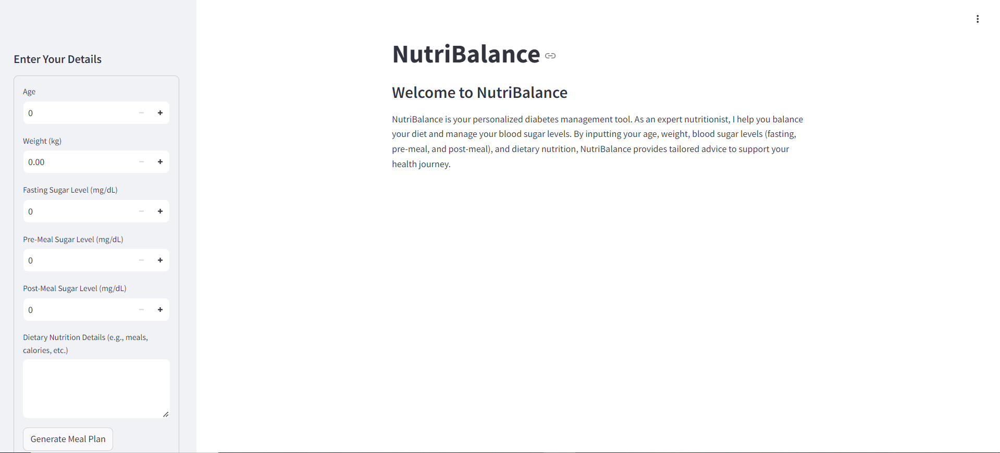

# 🍽️ NutriBalance

**NutriBalance** is a personalized diabetes management tool built with Streamlit and powered by Claude AI from Anthropic. This app helps users manage their blood sugar levels by providing tailored nutritional advice based on individual health data. The advice includes balanced meal options designed to maintain stable blood sugar levels, support overall health, and cater to specific dietary needs.

## Features

- **Personalized Meal Planning**: Input your age, weight, and blood sugar levels to receive customized meal plans.
- **Expert Advice**: The app simulates advice from a world-class nutritionist, focusing on low glycemic index foods, portion control, and nutritional balance.
- **Interactive Interface**: A user-friendly sidebar allows for easy input of personal health data.

## Installation

1. Clone the repository:

   ```bash
   git clone https://github.com/your-username/NutriBalance.git
   cd NutriBalance
   ```

2. Install the required dependencies:

   ```bash
   pip install -r requirements.txt
   ```

3. Set up your Claude API key:

   - Store your API key securely in Hugging Face secrets.
   - Ensure that the environment variable `CLAUDE_API_KEY` is set to your API key.

4. Run the Streamlit app:

   ```bash
   streamlit run app.py
   ```

## Usage

1. Enter your personal health data, including age, weight, fasting sugar level, pre-meal sugar level, post-meal sugar level, and dietary nutrition details.
2. Click on the "Generate Meal Plan" button to receive expert nutritional advice.
3. View the customized meal plan generated by Claude AI in the app interface.

## App Interface

- **Title**: "NutriBalance"
- **Description**: Overview of the app's purpose and functionality.
- **Sidebar Form**: Input form to collect user details (age, weight, blood sugar levels, dietary nutrition).
- **Output**: Displays expert nutritional advice generated by Claude AI.

## Screenshots




## Acknowledgements

- **Anthropic's Claude AI** for providing the AI model.
- **Streamlit** for the easy-to-use platform to deploy the app.

 
